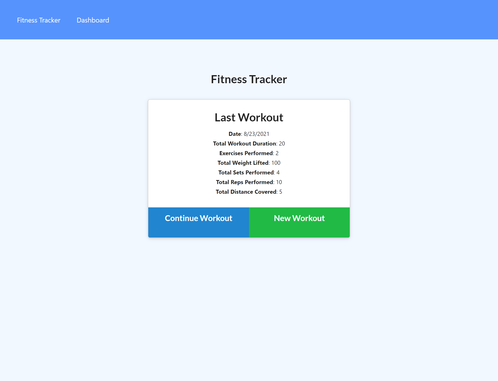
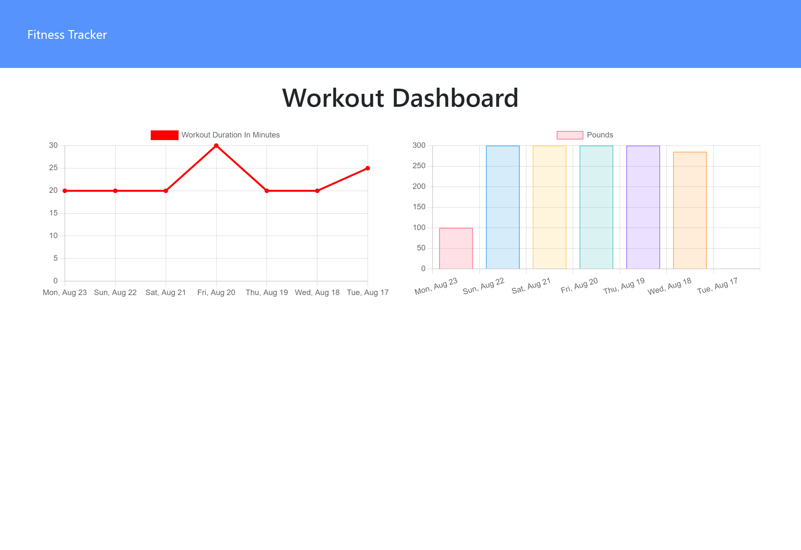

# Fitness Tracker
 &nbsp;&nbsp;&nbsp;&nbsp; &nbsp;&nbsp;&nbsp;&nbsp; &nbsp;&nbsp;&nbsp;&nbsp;


## :memo: Description
  This is a Workout Tracker web application that uses Mongo database and Mongoose schema, handling routes with Express.


## :trophy: Table of Contents
* [Installation](#installation)
* [Usage](#usage)
* [Contributing](#contributing)
  
  
## Installation
To run locally:
* Fork the https://github.com/Karina5151/E-Commerce-Back-End repo.
* Clone your forked repo to VS Code on your computer.
* Open entire parent folder of the project in your terminal.
* Install the node dependencies by entering in the terminal:
```
npm i
```

* Then enter `npm run seed` in the terminal to fill the data from the seed files into Robo3T to make sure it is populating.
* Then enter `npm start` to see in the browser. The application will then be listening on port 3000. Open your browser and put `localhost:3000` in the address bar of the browser page to see the application on your local device.

  
## Usage
Users can enter detailed exercise information to create historical workout logs to reference. 

Launch Github deployed web application [here](https://fierce-hamlet-39609.herokuapp.com/)




  
## Contributing
This application was developed by Karina Clausen.

The technologies that made this possible are:
* HTML
* CSS
* <a href="https://www.javascript.com/" target="_blank">JavaScript</a>
* <a href="https://nodejs.org/api/fs.html" target="_blank">Node.js</a>
* <a href="https://expressjs.com/" target="_blank">Express.js</a>
* <a href="https://www.json.org/json-en.html" target="_blank">JSON</a>
* <a href="https://getbootstrap.com/" target="_blank">Bootstrap</a>
* <a href="https://www.mongodb.com/" target="_blank">Mongo</a>
* <a href="https://mongoosejs.com/" target="_blank">Mongoose</a>


  
 ---

## :question: Questions

For any questions, please contact me using the information below:

:octocat: GitHub: [@Karina5151](https://github.com/Karina5151)

:envelope: Email: karina.clausen.11@gmail.com
